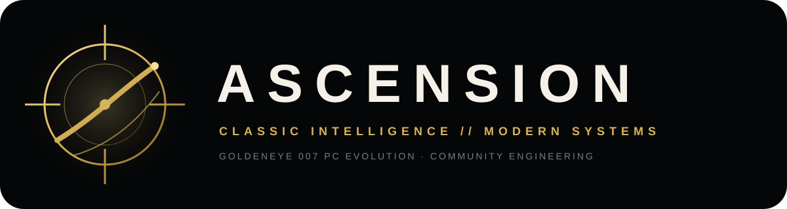
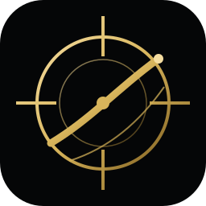

<p align="center"></p>
<p align="center"><strong>O clássico. Elevado.</strong><br>Preservação · Português · Experiência moderna · Engenharia aberta</p>
<p align="center">
  <a href="https://github.com/MukaSanches/goldeneye-ascension/actions/workflows/ci.yml"></a>
  <a href="LICENSE"></a>
  
</p>
<p align="center"><a href="https://mukasanches.github.io/goldeneye-ascension/"><strong>Site</strong></a> · <a href="ROADMAP_ASCENSION.md">Roadmap</a> · <a href="docs/PROJECT_STATUS.md">Status</a> · <a href="docs/cursos/README.md"><strong>Cursos</strong></a> · <a href="docs/GUIA-INICIANTE.md">Guia</a> · <a href="CONTRIBUTING.md">Contribuir</a> · <a href="SUPPORT.md">Suporte</a></p>

<p align="center"></p>

## Ascension

**Ascension** é uma linha independente de desenvolvimento do port nativo de **GoldenEye 007 (Nintendo 64, 1997)** para computadores modernos. O projeto preserva a genealogia técnica, os créditos e as licenças da base da qual deriva, enquanto mantém roadmap, documentação, localização e experiência de PC próprios.

A regra de produto é simples: **preservar o clássico sem congelá-lo no tempo**. Mudanças modernas devem ser deliberadas, testáveis e, quando alterarem a experiência original, preferencialmente opcionais.

> **Este repositório não distribui ROM comercial nem assets proprietários do jogo.** O usuário fornece a própria cópia legalmente obtida quando o processo de build exigir.

## Estado do projeto

| Área | Referência atual |
|---|---|
| Branch principal | `main` |
| Plataforma primária | Windows 10/11 com MSYS2 MINGW64 |
| Build de referência | `ntsc-final` |
| CI | validação e builds automatizados em GitHub Actions |
| Localização | PT-BR é a primeira localização Ascension; inglês permanece referência/fallback |
| Educação | Ascension Learning Series com 20 cursos em PDF e geração reproduzível |
| Distribuição | código e ferramentas; sem ROM e sem assets comerciais |
| Qualidade | build, teste automatizado e playtest são evidências diferentes |

O estado detalhado e os critérios de maturidade ficam em [`docs/PROJECT_STATUS.md`](docs/PROJECT_STATUS.md). O histórico de mudanças públicas passa a ser registrado em [`CHANGELOG.md`](CHANGELOG.md).

## Começo rápido — Windows

Use o terminal **MSYS2 MINGW64**.

```sh
pacman -S --needed mingw-w64-x86_64-toolchain mingw-w64-x86_64-SDL2 mingw-w64-x86_64-zlib mingw-w64-x86_64-cmake mingw-w64-x86_64-python make git

git clone https://github.com/MukaSanches/goldeneye-ascension.git
cd goldeneye-ascension
```

Para a ROM americana suportada, o caminho esperado é:

```text
data/ge007.ntsc-final.z64
```

Compile e execute:

```sh
./build-pc.sh ntsc-final
./build-pc/ge007.x86_64.exe
```

Se a preparação de dados ou o build falhar, consulte [`docs/building.md`](docs/building.md) antes de abrir uma issue. **Nunca** anexe ou faça commit da ROM.

## Direção Ascension

| Pilar | Compromisso |
|---|---|
| **Classic** | comportamento original continua sendo a referência |
| **Brasil** | localização PT-BR com revisão humana e fallback seguro |
| **Modern Controls** | teclado, mouse e controle configuráveis sem sacrificar o modo clássico |
| **PC Experience** | vídeo, HUD, configuração e qualidade de vida com opções claras |
| **Accessibility** | melhorias úteis, explícitas e testáveis |
| **Engineering** | mudanças pequenas, rastreáveis, reversíveis e com evidência de teste |
| **Community** | documentação suficiente para quem joga, estuda, depura ou contribui |

## Mapa técnico

| Objetivo | Primeiro lugar para investigar |
|---|---|
| Teclado, mouse e controle | `port/src/input.c` |
| Configuração | `port/src/config.c`, `ge007.ini` |
| Janela e vídeo | `port/src/video.c` |
| Áudio | `port/src/audio.c` |
| Renderização | `port/fast3d/` |
| Integração PC | `port/src/` |
| Lógica reconstruída | `src/` |
| Estruturas | `include/` |
| Ferramentas de dados | `tools_pc/` |
| Site e documentação | `docs/` |

## Como uma mudança ganha confiança

Ascension não trata “compilou” como sinônimo de “está pronto”. A sequência esperada é:

**entender → alterar → compilar → testar → jogar quando necessário → revisar o diff → documentar → integrar**.

Para mudanças de renderização, áudio, input, HUD ou localização, o teste humano faz parte da validação. Para bugs determinísticos, prefira também uma reprodução pequena e repetível.

```sh
git switch main
git pull --ff-only
git switch -c fix/minha-alteracao
# altere, compile e teste
git status
git diff --check
git diff
```

Leia [`CONTRIBUTING.md`](CONTRIBUTING.md) antes de enviar um Pull Request.

## Ascension Learning Series

O repositório inclui uma coleção editorial própria com **20 cursos**, cobrindo cinema, história do jogo, fundamentos de gameplay, campanha, combate, multiplayer, level design, tecnologia do Nintendo 64, bastidores de desenvolvimento, identidade Ascension, instalação, MSYS2/CMake, ROM e sidecars, `ge007.ini`, Git/GitHub, testes, localização PT-BR e o caminho até a versão 1.0.

Os cursos vivem em [`docs/cursos/`](docs/cursos/README.md). Cada PDF é gerado a partir de fontes JSON versionadas e de um gerador vetorial em Python, permitindo revisar conteúdo e diagramação no mesmo histórico do projeto. O workflow [`.github/workflows/courses.yml`](.github/workflows/courses.yml) recompõe automaticamente o catálogo e os 20 PDFs quando a fonte editorial muda.

**[Abrir a Ascension Learning Series](docs/cursos/README.md)**

## Roadmap

| Marco | Foco |
|---|---|
| **V0.1 — Fundação** | build reproduzível, CI e execução confiável |
| **V0.2 — Brasil** | arquitetura de localização e experiência PT-BR |
| **V0.3 — Modern Controls** | presets, remapeamento e refinamento de input |
| **V0.4 — PC Experience** | configuração e qualidade de vida |
| **V0.5 — Classic / Enhanced** | separar preservação de melhorias opcionais |
| **V0.6 — Estabilidade** | campanha, regressões e compatibilidade |
| **V0.7 — Presentation** | vídeo, HUD e refinamentos visuais |
| **V0.8 — Modding** | interfaces e ferramentas para a comunidade |
| **V1.0** | release estável com instalação, compatibilidade e limites documentados |

O roadmap completo, com critérios de saída, está em [`ROADMAP_ASCENSION.md`](ROADMAP_ASCENSION.md).

## Documentação

- [`docs/cursos/README.md`](docs/cursos/README.md) — Ascension Learning Series, catálogo e 20 cursos em PDF.
- [`docs/PROJECT_STATUS.md`](docs/PROJECT_STATUS.md) — o que está estável, experimental ou em andamento.
- [`docs/GUIA-INICIANTE.md`](docs/GUIA-INICIANTE.md) — entrada para novos usuários e contribuidores.
- [`docs/ASCENSION.md`](docs/ASCENSION.md) — identidade, princípios e governança técnica.
- [`ROADMAP_ASCENSION.md`](ROADMAP_ASCENSION.md) — direção de produto e engenharia.
- [`docs/RELEASES.md`](docs/RELEASES.md) — critérios e processo de release.
- [`docs/PROVENANCE.md`](docs/PROVENANCE.md) — proveniência e uso responsável de conhecimento externo.
- [`docs/building.md`](docs/building.md) — build e preparação de dados.
- [`docs/internals.md`](docs/internals.md) — arquitetura interna.
- [`docs/porting-notes.md`](docs/porting-notes.md) — conhecimento técnico acumulado.
- [`docs/dev/`](docs/dev/) — investigações, achados e registros de engenharia.

## Contribuição e suporte

Uma boa contribuição explica **o problema**, **por que a solução pertence ao projeto**, **o que mudou**, **como foi testado** e **qual risco permanece**. Mudanças amplas sem evidência são mais difíceis de revisar do que mudanças pequenas e verificáveis.

Para dúvidas de build e execução, veja [`SUPPORT.md`](SUPPORT.md). Para vulnerabilidades, use a política em [`.github/SECURITY.md`](.github/SECURITY.md).

## Origem, créditos e licença

Ascension existe sobre anos de decompilação, engenharia reversa, pesquisa e portabilidade da comunidade. Direção própria não substitui autoria histórica. GoldenEye, James Bond e marcas relacionadas pertencem aos respectivos titulares.

Consulte [`NOTICE`](NOTICE), [`LICENSE`](LICENSE), [`CITATION.cff`](CITATION.cff) e [`docs/PROVENANCE.md`](docs/PROVENANCE.md).

---
<p align="center"><br><strong>ASCENSION</strong><br>Preservar o clássico. Elevar a experiência. Abrir o conhecimento.</p>